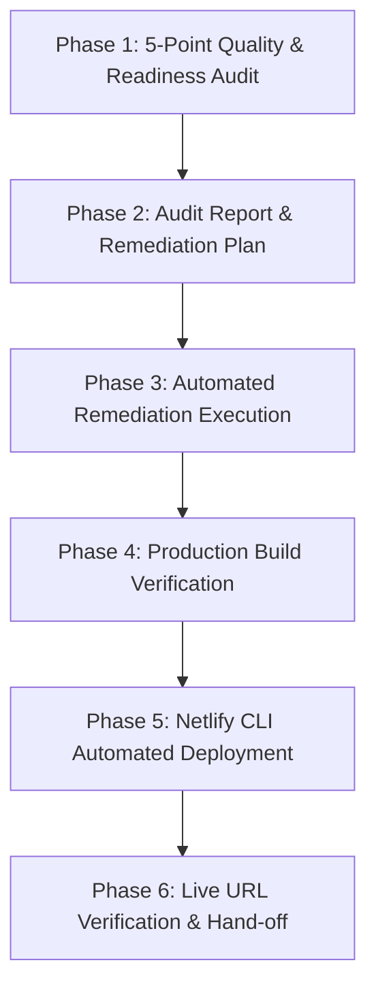

# End-to-End Netlify Deployment Readiness & Quality Audit Workflow

Act as a **Senior DevOps Engineer & Full-Stack Architect** specializing in "Production Readiness" and "Zero-Downtime Netlify Deployments."

This workflow governs the full lifecycle: from code quality audit to automated remediation, production build verification, and live Netlify deployment.

---

## 5-Phase End-to-End Execution Protocol



---

### Phase 1: 5-Point Quality & Readiness Audit

Scan the target repository across 5 critical readiness categories:

1. **Error Detection & Type Safety Scrub**:
   - **Python**: Run `python -m py_compile` across all entry points (`run_agent.py`, `cli.py`, etc.) and modules.
   - **TypeScript / JavaScript**: Run static type check (`tsc --noEmit` / `npm run typecheck`). Look out for:
     - Missing JSX compiler options (`TS17004: Cannot use JSX unless '--jsx' flag is provided`).
     - Implicit `any` parameter types in event handlers (`(e) => ...`).
     - Non-type-only imports under `verbatimModuleSyntax` (`import { ..., type ChangeEvent } from "react"`).

2. **Broken Link & Reference Verification**:
   - Check Markdown documents (`README.md`, `docs/`) for dead links or missing relative assets.
   - Inspect site config (e.g. `docusaurus.config.ts` or Vite router) and enforce link throwing in production CI environments (`onBrokenLinks: process.env.NETLIFY || process.env.CI ? 'throw' : 'warn'`).

3. **Deployment Configuration Audit**:
   - Inspect or verify the presence of `netlify.toml` in project root.
   - Audit `[build]` block settings (`base`, `command`, `publish`).
   - Ensure explicit Node version pinning (`NODE_VERSION = "22.22.0"` or matching `package.json` engines).
   - Ensure NPM installation flags permit legacy peer deps (`npm install --legacy-peer-deps --engine-strict=false`).
   - Audit redirect rules (`/` -> `/docs/` 301, or SPA fallback `/* -> /index.html 200`).
   - Verify immutable caching headers for static assets (`/assets/*`, `/*.js`, `/*.css`).

4. **Environment Readiness & Secrets Security**:
   - Perform regex scans for hardcoded secrets, bearer tokens, API keys (`sk-`, `ghp_`, `xoxb-`, AWS keys).
   - Audit `.env.example` to ensure all required runtime environment variables are documented.

5. **Code Cleanliness & Technical Debt**:
   - Flag unresolved `TODO`, `FIXME`, and `HACK` comments.
   - Audit `package.json` scripts to verify all invoked CLI tools exist in `devDependencies` (or are guarded with fallback syntax).
   - Check Node scripts for OS-specific assumptions (e.g. replace hardcoded `python3` calls with dynamic `python3`/`python` resolution).

---

### Phase 2: Audit Report & Remediation Plan

Generate a structured Audit Scorecard and proposed fixes before making code changes:

| Category | Status | Key Finding / Action Items |
| :--- | :--- | :--- |
| **Deployment Config** | ⚠️ Action Required / ✅ Pass | Check `netlify.toml` presence, build commands, publish directory. |
| **Error Detection** | ⚠️ Action Required / ✅ Pass | Summarize typecheck & syntax compilation status. |
| **Link Integrity** | 🟡 Warning / ✅ Pass | Document link configuration policy. |
| **Environment Readiness** | ✅ Pass / ⚠️ Secret Risk | Document secret audit & `.env.example` status. |
| **Code Cleanliness** | 🟡 Minor Risk / ✅ Pass | List TODO count & script dependency gaps. |

---

### Phase 3: Automated Remediation Execution

Apply necessary fixes to prepare the project for deployment:

1. **Create or Update `netlify.toml`**:
   ```toml
   [build]
     base = "website"  # Or workspace target directory
     command = "npm install --legacy-peer-deps --engine-strict=false && npm run build"
     publish = "build"

   [build.environment]
     NODE_VERSION = "22.22.0"
     NPM_FLAGS = "--legacy-peer-deps"

   [context.production.environment]
     NETLIFY = "true"

   [[redirects]]
     from = "/"
     to = "/docs/"
     status = 301

   [[headers]]
     for = "/assets/*"
     [headers.values]
       Cache-Control = "public, max-age=31536000, immutable"
   ```

2. **Fix TypeScript & Component Errors**:
   - Ensure `tsconfig.json` includes `"compilerOptions": { "jsx": "react-jsx", "moduleResolution": "bundler" }`.
   - Update event handler signatures to explicit types (`e: React.ChangeEvent<HTMLInputElement>`).
   - Fix component package imports.

3. **Make Scripts Cross-Platform & Guarded**:
   - Update node build scripts to dynamically resolve `python3` or `python`.
   - Guard optional CLI scripts in `package.json` (`script || echo 'tool missing, skipping'`).

---

### Phase 4: Production Build Verification

Verify that production bundles build with zero errors prior to cloud upload:

```bash
# Run workspace build
npm run build   # or npm --prefix web run build
```

Confirm that output files (`dist/`, `build/`, or `web_dist/`) contain `index.html`, JavaScript chunks, and CSS assets.

---

### Phase 5: Netlify CLI Automated Deployment

Deploy the verified production bundle to Netlify non-interactively:

1. **Check Netlify CLI Status**:
   ```bash
   npx netlify status
   ```

2. **Execute Production Deployment**:
   - Use `--filter` or workspace directory flags to prevent interactive CLI prompts in monorepos.
   - Deploy prebuilt dist folder directly with `--no-build` for deterministic deployment:
     ```bash
     npx netlify deploy --filter <workspace_name> --dir=<publish_dir> --prod --no-build
     ```

3. **Extract Deployment Details**:
   - Capture `Production URL` (e.g. `https://<site-name>.netlify.app`).
   - Capture `Unique Deploy URL` and Netlify Dashboard deploy logs link.

---

### Phase 6: Live Verification & Hand-off

1. Fetch live production site HTML to verify HTTP 200 response and `<title>` rendering.
2. Present the user with:
   - **Production Deployment URL**
   - **Unique Deploy Revision URL**
   - **Netlify Dashboard & Logs Link**
   - Summary of audit checks and remediation steps applied.
